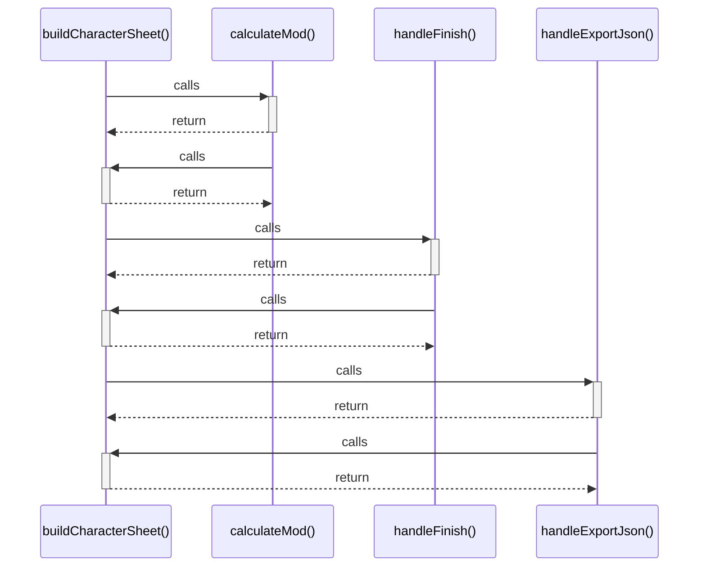

# buildCharacterSheet()

> God node · 4 connections · [C:\Users\axels\Downloads\CW for MCU 11.1\grimorio\src\components\CharacterCreatorView.tsx](file:///C:/Users/axels/Downloads/CW%20for%20MCU%2011.1/grimorio/src/components/CharacterCreatorView.tsx#L246)

## Call Trace Diagram

## Connections by Relation

### calls
- [[calculateMod()]] `EXTRACTED`
- [[handleFinish()]] `EXTRACTED`
- [[handleExportJson()]] `EXTRACTED`

### contains
- [[CharacterCreatorView.tsx]] `EXTRACTED`

---

*Part of the graphify knowledge wiki. See [[index]] to navigate.*