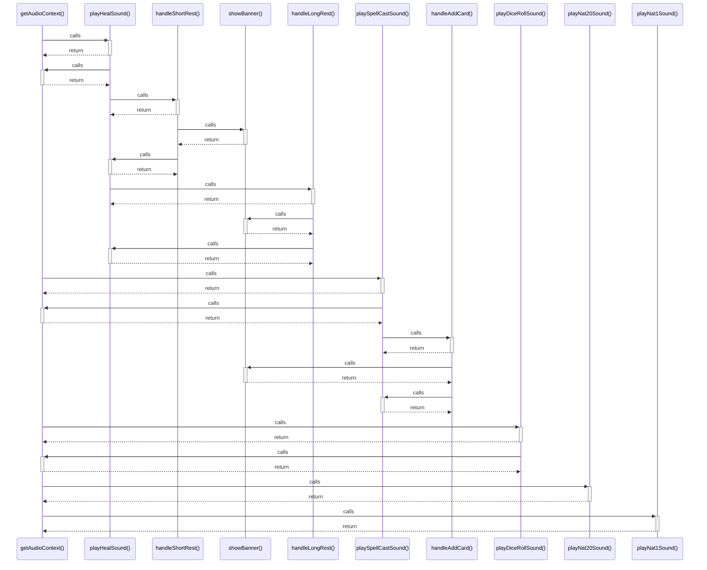

# getAudioContext()

> God node · 6 connections · [C:\Users\axels\Downloads\CW for MCU 11.1\grimorio\src\utils\audio.ts](file:///C:/Users/axels/Downloads/CW%20for%20MCU%2011.1/grimorio/src/utils/audio.ts#L3)

## Call Trace Diagram

## Connections by Relation

### calls
- [[playHealSound()]] `EXTRACTED`
- [[playSpellCastSound()]] `EXTRACTED`
- [[playDiceRollSound()]] `EXTRACTED`
- [[playNat20Sound()]] `EXTRACTED`
- [[playNat1Sound()]] `EXTRACTED`

### contains
- [[audio.ts]] `EXTRACTED`

---

*Part of the graphify knowledge wiki. See [[index]] to navigate.*