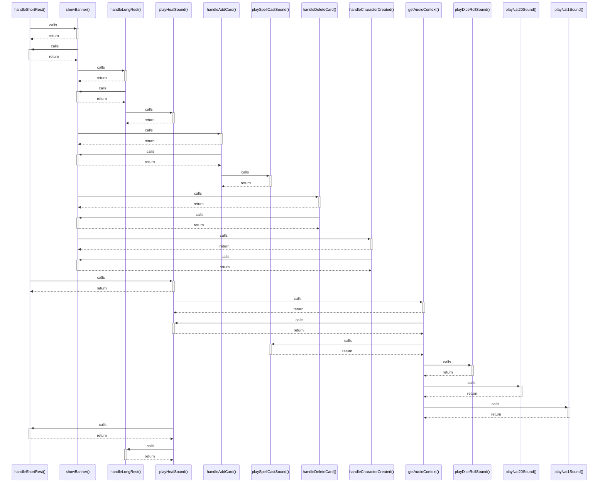

# handleShortRest()

> God node · 3 connections · [C:\Users\axels\Downloads\CW for MCU 11.1\grimorio\src\App.tsx](file:///C:/Users/axels/Downloads/CW%20for%20MCU%2011.1/grimorio/src/App.tsx#L142)

## Call Trace Diagram

## Connections by Relation

### calls
- [[showBanner()]] `EXTRACTED`
- [[playHealSound()]] `INFERRED`

### contains
- [[App.tsx]] `EXTRACTED`

---

*Part of the graphify knowledge wiki. See [[index]] to navigate.*