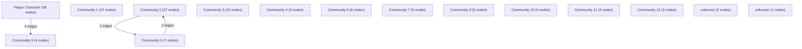

# Knowledge Graph Index

> Auto-generated by graphify. Start here — read community articles for context, then drill into god nodes for detail.

**195 nodes · 200 edges · 15 communities**

---

## System Architecture Flowchart

## Communities
(sorted by size, largest first)

- [[Player Character]] — 58 nodes
- [[Community 1]] — 37 nodes
- [[Community 2]] — 27 nodes
- [[Community 3]] — 24 nodes
- [[Community 4]] — 9 nodes
- [[Community 5]] — 7 nodes
- [[Community 6]] — 6 nodes
- [[Community 7]] — 5 nodes
- [[Community 8]] — 5 nodes
- [[Community 9]] — 4 nodes
- [[Community 10]] — 4 nodes
- [[Community 11]] — 3 nodes
- [[Community 12]] — 3 nodes
- [[unknown]] — 2 nodes
- [[unknown]] — 1 nodes

## God Nodes
(most connected concepts — the load-bearing abstractions)

- [[showBanner()]] — 6 connections
- [[getAudioContext()]] — 6 connections
- [[buildCharacterSheet()]] — 4 connections
- [[playHealSound()]] — 4 connections
- [[handleShortRest()]] — 3 connections
- [[handleLongRest()]] — 3 connections
- [[handleAddCard()]] — 3 connections
- [[getEffectiveAbility()]] — 3 connections
- [[playSpellCastSound()]] — 3 connections
- [[handleRollDice]] — 2 connections

---

*Generated by [graphify](https://github.com/safishamsi/graphify)*